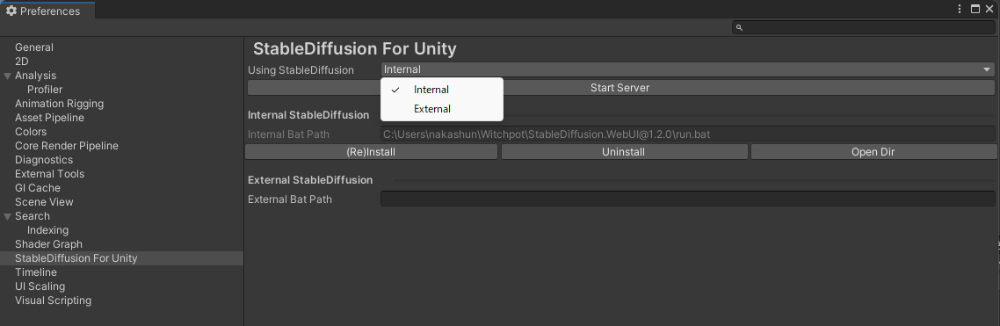
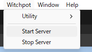
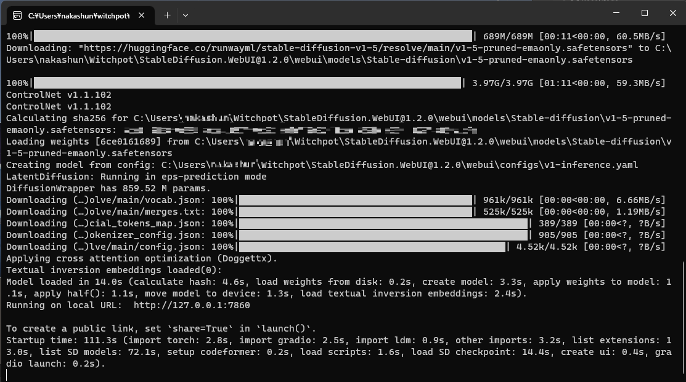
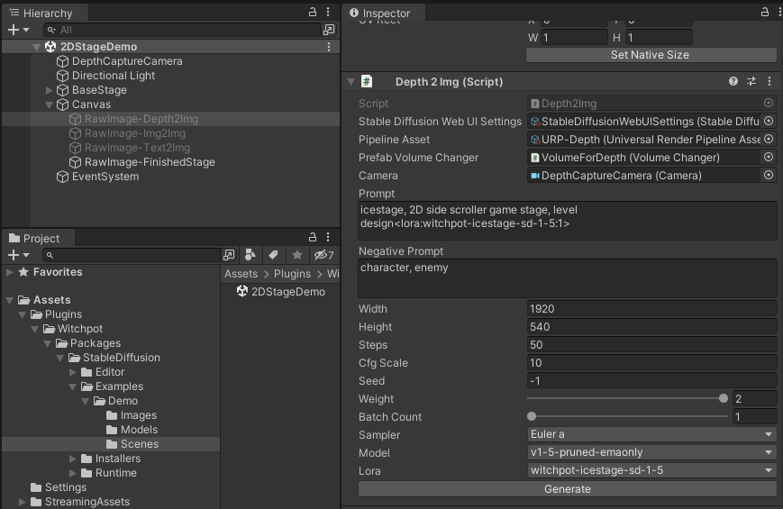

# stable-diffusion-for-unity

Image assets generation using [Stable Diffusion web UI](https://github.com/AUTOMATIC1111/stable-diffusion-webui) within Unity

    

## Features
You can generate image assets on Unity.
- Depth to Image
- Text to Image
- Image to Image

## Recomended Environment
- OS: Windows
- VRAM: 8GB~
- Unity version: Unity2021
    - RenderPipeline: URP

## Installation and Running
Please see [Documents](https://docs.witchpot.com/) for more informations.

1. Download latest unitypackage from [Release page](https://github.com/witchpot-studio/stable-diffusion-for-unity/releases/tag/v1.2.0).    
2. Import the unitypackage to your unity project.    
3. Install stable diffusion webui    

    We have options for the webui which you use for this project
    - Internal StableDiffusion    
    This is the Default option. Witchpot's custom webui.     
    StableDiffusion will be automatically installed in C drive User folder.
    - External StableDiffusion    
    You can use your own locally installed webui.    
    Requirement: You need to preinstalled forked webui from AUTOMATIC1111    
    To enable the webui api mode, add the following option to the bat file    
        ```
        set COMMANDLINE_ARGS=--api
        ```    
        Please specify the path of the webui-user.bat path for the External bat path.    
4. Start Server from Menu bar > Witchpot > StartServer     

5. (If you use Internal webui) Wait until installation finished on CommandPrompt: local URL shown when the installation finished    

6. Confirm 2DStageDemo scene    
    Assets/Plugins/Witchpot/Packages/StableDiffusion/Example/Demo/Scenes/2DStageDemo
7. Generate Depth2Img     
    Generate image from Depth2Img component.    
    When you use the Depth2Img component attached yourself in your scene, please check PipelineAsset/PrefabVolumeChanger is set.    
    If blank, set URP-Depth to PipelineAsset and VolumeForDepth prefab to PrefabVolumeChanger.    
    Both are in Assets/Plugins/Witchpot/Packages/StableDiffusion/Runtime/Settings.    


## Contributing
In Preparation.

## License
Distributed under MIT License.
Also this system installs and uses code from our repository (https://github.com/witchpot-studio/stable-diffusion-webui) which fork from [Stable Diffusion web UI](https://github.com/AUTOMATIC1111/stable-diffusion-webui).
If you modify these repository, please apply the GPL v3 license.


